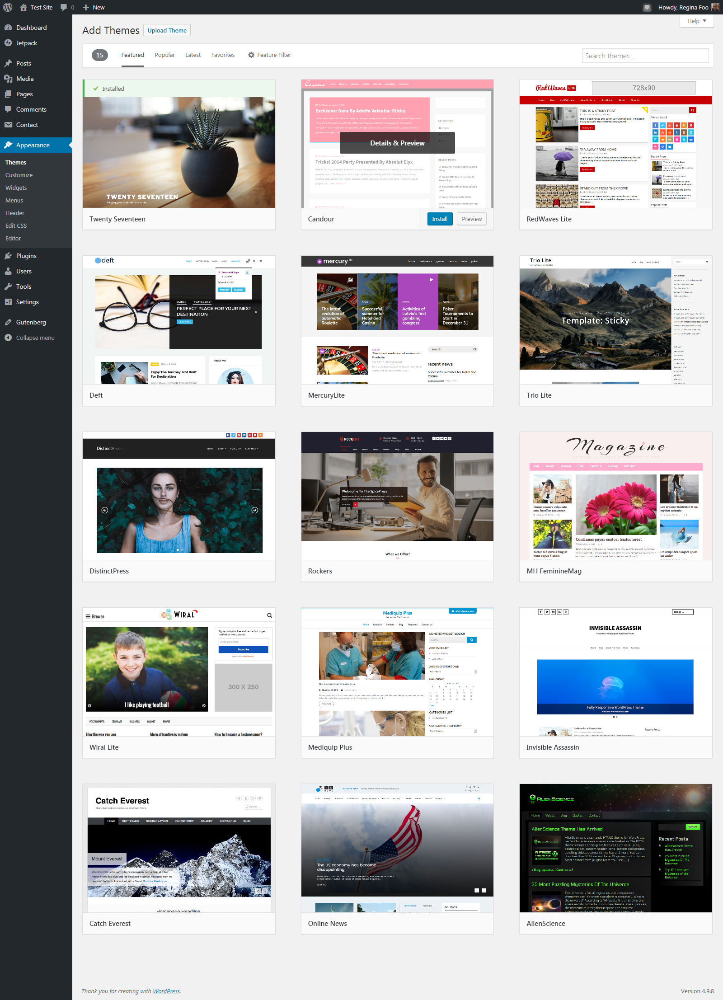
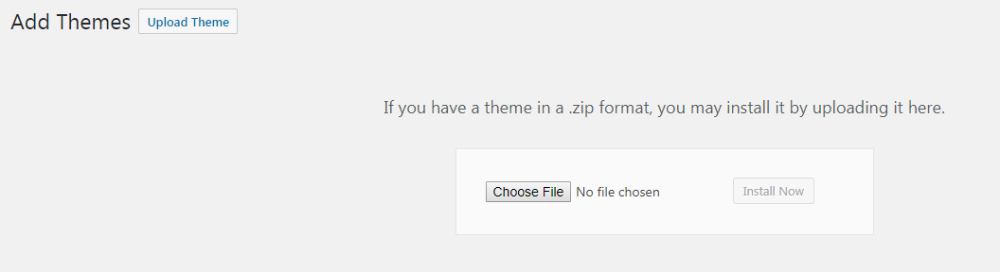
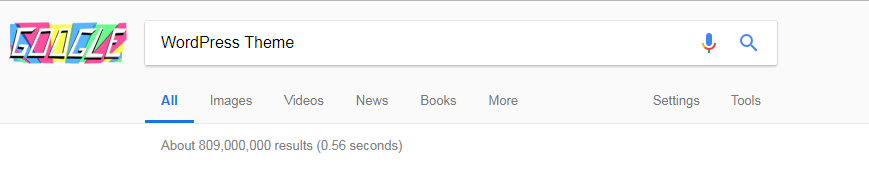
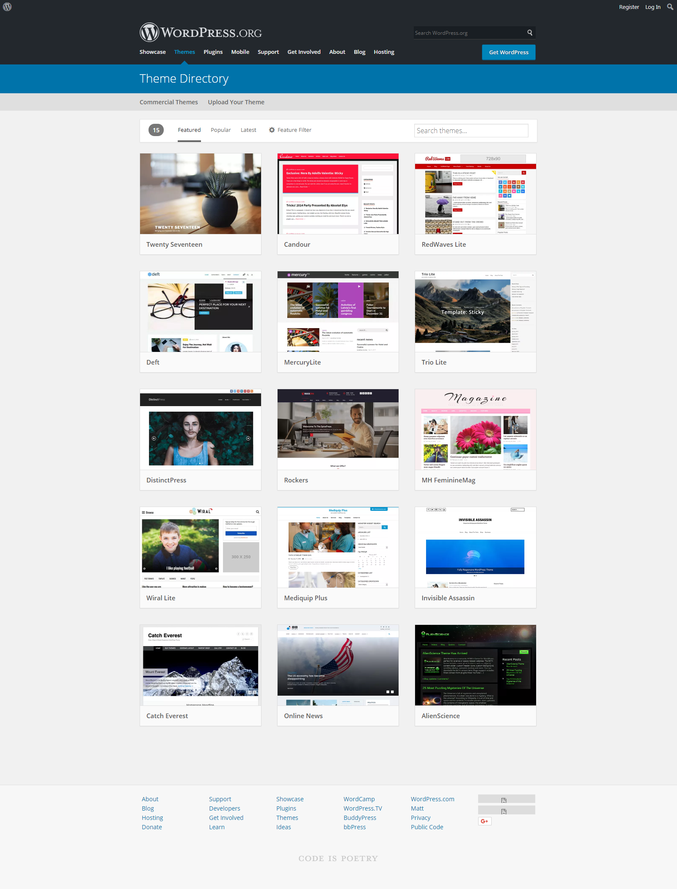

# Choosing And Installing Themes

## Description

In this lesson you will learn how there are over 6000 free themes in the [official WordPress.org directory](https://wordpress.org/themes/) and at least as many in the commercial space. This lesson will give you the tools needed to thoroughly evaluate themes and choose the most appropriate for your site(s).

## Objectives

After completing this lesson, participants will be able to:
*   Outline where to find themes; as well as highlighting the best place to start looking.
*   Explain what to look for and consider in a good theme.
*   Describe how to evaluate a theme.
*   Demonstrate how to install a theme.

## Target Audience

Who is this lesson intended for? What interests/skills would they bring? Choose all that apply.

* [X] Users
* [ ] Designers
* [ ] Developers
* [ ] Speakers
* [ ] All

## Experience Level

How much experience would a participant need to get the most from this lesson?

* [X] Beginner
* [ ] Intermediate
* [ ] Advanced
* [ ] Any

## Type of Instruction

Which strategies will be used for this lesson plan? Choose all that apply.

* [X] Demonstration
* [ ] Discussion
* [X] Exercises
* [ ] Feedback
* [X] Lecture (Presentation)
* [ ] Show & Tell
* [ ] Tutorial

## Time Estimate (Duration)

How long will it take to teach this lesson (in minutes)?

45 minutes

## Prerequisite Skills

Participants will get the most from this lesson if they have familiarity with:

* Proficiency in content editing
* Proficiency in navigating through the WordPress Administration Panels

## Readiness Questions

*   Do you publish a WordPress site at this moment? (Preferred answer: yes)
*   Which theme are you currently using? (Preferred answer: anything but "I don't know")
*   Are you satisfied with the theme you are currently using?
*   How many other themes have you tried?

## Materials Needed

*   WordPress site to practice installing themes
*   A free theme in zipped format to practice uploading themes

## Notes for the Instructor

*   The last two screening questions do not have preferred answers. They are there to condition the students for the material you will be showing.
*   The lesson should alternate between short lectures and live demos. You, as the teacher, need a working local WordPress installation for the demos.
*   Students should not be working on their site during lectures and demos. Questions from students will be very specific to their case, so it is better to plan a period where the students can test things on their own site and you are able to answer their questions individually.

## Have You Thought About...?

* What if the participant doesn't have a WordPress site?
* What if the participant's site is on WordPress.com that doesn't allow uploading a theme?

## Lesson Overview

* Introduction to themes as the presentation of content
* Present the Theme Directory on WordPress.org
* Describe the consideration and criteria in choosing the correct theme
* Demonstrate how to install and activate a theme
* Practice exercises to have participants find and install a theme on their own site

## Exercises

**Installing the Chosen Theme**

Choosing and install a theme from the Theme Directory.

* Log in to the WordPress [Administration Panels](https://codex.wordpress.org/Administration_Panels "Administration Panels").
* Select the [Appearance](https://codex.wordpress.org/Administration_Panels#Appearance_-_Change_the_Look_of_your_Blog "Administration Panels") panel, then [Themes](https://codex.wordpress.org/Administration_Panels#Themes "Administration Panels").
* Select **Add New**.
* To install a theme from the [Theme Directory](https://wordpress.org/themes/), either use the **Search** or **Filter** options to locate a theme you would like to use. Click on the **Preview** link to preview the theme or the **Install Now** link to install the theme.

**Uploading a Theme**

Upload and Install a theme by using a zipped file.

*  Log in to the WordPress **Administration Panels**.
*  Select the **Appearance** panel, then **Themes**.
*  Select **Add New**.
*  To install a theme that you have previously downloaded to your machine, use the **Upload** link in the top links row to upload a zipped copy of a theme.

**Activate Your Theme**

Once your theme is installed, activate it to make it visible on your website. 

* Log in to the WordPress **Administration Panels**.
*  Select the **Appearance** panel, then **Themes**.
*  From the themes panel, roll over the theme thumbnail image for the theme you are interested in to see options for that theme.
*  You can view more information about any theme by clicking **Theme Details**.
*  A live preview of any theme (using your blog's content) can be seen by clicking "Live Preview".
*  To activate the theme click the **Activate** button.

## Assessment

**Where are some suggested places to locate themes? (You may choose more than one)**

1.  Commercial WordPress Theme Shops
2.  A Google Search for Free WordPress Themes
3.  WordPress Theme Directory
4.  Your Local Office Supply Store

**Answer:** 1\. Commercial WordPress Theme Shops or 2\. WordPress Theme Directory

**Which of the following is NOT a criteria when choosing a theme?**
1. Browser compatibility
2. WordPress and plugins compatibility
3. Responsive
4. Freebies received from a Premium theme

**Answer:** 4\. Freebies received from a Premium theme

## Additional Resources

> 
* [Using Themes](https://codex.wordpress.org/Using_Themes) @ Codex
* [Selecting the Perfect WordPress Theme](https://www.wpbeginner.com/wp-themes/selecting-the-perfect-theme-for-wordpress/) @ WPBeginner
* [Choosing A WordPress Theme – The Ultimate Guide](https://www.wpkube.com/choosing-a-wordpress-theme/) @ WPKube

## Example Lesson

### Introduction

You are using WordPress, a content management system (CMS). Your content is completely separated from its presentation. This means that the look and feel of your site can change completely just by using a different theme, while your content will remain the same. 

Themes do a lot more than defining how your site looks, though. They can choose to hide or show some of your content or metadata, enable and disable WordPress features, and provide you with locations in the design where you can insert widgets and menus. They can even enable features that are specific to them.

### Where to find Themes?

WordPress themes are everywhere. If you were to do a Google search for "WordPress Theme" you would find over 809,000,000 results! Keep in mind though that not all themes are created equal. 

If you are going to download a WordPress theme, please make sure it is from a reputable place. Sometimes websites advertising free WordPress themes are really distributing themes with malicious code or themes that have not been tested or are not well supported. 

If you are searching for a free WordPress theme, it is wise to start with the [WordPress Theme Directory](https://wordpress.org/themes/). All of these themes have been reviewed by a team of WordPress developers and tested against the latest coding standards. 

If you are interested in purchasing a commercial WordPress theme, take a look at the list of [commercially supported GPL themes](https://wordpress.org/themes/commercial/). While details vary by company, most of the themes offer additional support that is not always available in the WordPress Theme Directory.

### What to consider when choosing a theme?

Before you even start to look at themes, it is important to have a solid idea of the purpose and audience for your site. Will your site function primarily as a personal blog for friends and family to read? Does your site focus on sharing articles and content, like a magazine or newspaper would? Or, are you looking to build a site for your business that showcases information about your staff and your services or products? 

You will also need to consider the kinds of content you will have for your site. Will photography be a main focus? If so, you may want to choose a theme that has large featured image areas. Will your site just focus on written content? If so, choose one with striking typography and a smaller emphasis on images. 

One important note: you should select a theme based on how it displays your content and not for specific features. You can always add specific features such as restaurant menus, calendars, contact forms and photo galleries via plugins.

### How to evaluate a theme?

Once you have you have your list of theme requirements, you will want to narrow down the possible themes. If you are reviewing themes in the Theme Directory, you can use feature filter option and select the features that are important to you. 

Take a look at what can be customized in each theme. Many themes come with additional color palletes, font choices and custom widget areas. These are all things that can be adjusted using the WordPress Customizer. 

Some of the important criteria when evaluating a theme:
* **Responsive**: Mobile devices are commonly used nowadays for web surfing. Choosing a theme that is responsive is no longer an option in order to support various types of smaller screens compared to a computer screen.
* **Browser Compatibility**: Visitors to your site could be using different kinds of browsers. Make sure the selected theme is able to support most of the major browser platforms on computers and mobile devices.
* **Ratings**: A theme with low ratings could mean that the theme has poor design, a lot of bugs or even poor support given by the theme designer. Make sure you read the ratings and review when selecting a theme.
* **Budget and Support**: Both of these criteria can be interrelated. Premium themes usually cost around $50 to $100 depending on the quality but that also means user can expect better and faster support from the theme designer. Free themes normally gets support on the WordPress.org support forum.
* **Compatibility with WordPress and Plugins**: This is one of the important criteria when choosing a theme, especially if you're building a site with extensive usage of plugins.

### Lesson Wrap Up

 Follow with the Exercises and Assessment outlined above.

